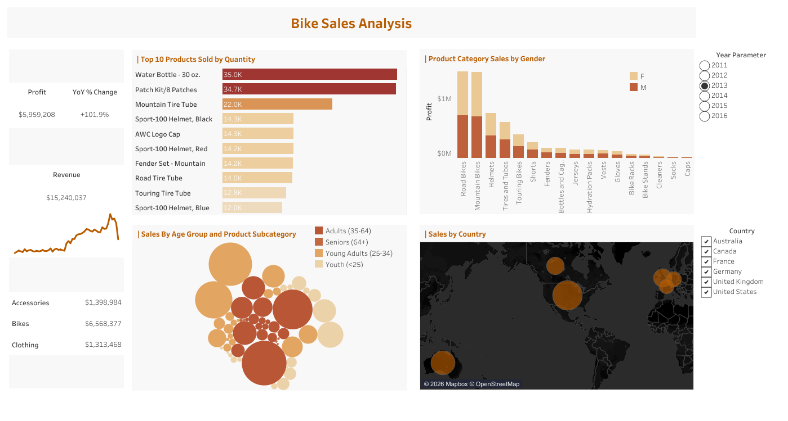

# 🚴 Bike Sales Dashboard Analysis

🔗 **Interactive Tableau Dashboard:**  
https://public.tableau.com/views/BikeSales_17792909133940/SalesDashboard?:language=en-US&:sid=&:redirect=auth&:display_count=n&:origin=viz_share_link

---

# 📷 Dashboard Preview

## Bike Sales Dashboard

[](https://public.tableau.com/views/BikeSales_17792909133940/SalesDashboard?:language=en-US&:sid=&:redirect=auth&:display_count=n&:origin=viz_share_link)

---

# 📌 Deskripsi Project
Project ini merupakan dashboard analisis penjualan sepeda menggunakan Tableau dengan fokus pada analisis performa sales, profit, customer behavior, dan product performance.

Dashboard dibuat untuk membantu stakeholder memahami:
- tren penjualan,
- profitabilitas,
- performa produk,
- segmentasi customer,
- serta distribusi penjualan berdasarkan wilayah.

Visualisasi dashboard dibuat secara interaktif menggunakan:
- KPI Cards
- Line Chart
- Bar Chart
- Donut Chart
- Map Visualization
- Interactive Filter

Project ini bertujuan untuk mendukung pengambilan keputusan bisnis berbasis data melalui visualisasi yang informatif dan interaktif.

---

# 🎯 Tujuan Project
- Menganalisis performa penjualan sepeda.
- Mengidentifikasi produk dengan sales dan profit tertinggi.
- Memahami segmentasi customer berdasarkan usia dan gender.
- Menganalisis distribusi sales berdasarkan negara dan state.
- Mengevaluasi profitabilitas produk.
- Menyediakan dashboard interaktif untuk eksplorasi data.

---

# 🗂️ Dataset Information

Dataset terdiri dari beberapa kolom utama:

| Kolom | Deskripsi |
|---|---|
| Date | Tanggal transaksi |
| Day | Hari transaksi |
| Month | Bulan transaksi |
| Customer_Age | Umur customer |
| Age_Group | Kelompok umur customer |
| Customer_Gender | Gender customer |
| Country | Negara customer |
| State | State/wilayah customer |
| Product_Category | Kategori produk |
| Sub_Category | Sub kategori produk |
| Product | Nama produk |
| Order_Quantity | Jumlah order |
| Unit_Cost | Harga modal |
| Unit_Price | Harga jual |
| Profit | Keuntungan |
| Cost | Total biaya |
| Revenue | Total pendapatan |

---

# 🛠️ Tools & Technologies
- Tableau
- Data Visualization
- Interactive Dashboard
- Business Intelligence
- Data Storytelling

---

# 📊 Dashboard Features

## ✅ KPI Monitoring
Dashboard menampilkan KPI utama seperti:
- Total Revenue
- Total Profit
- Total Orders
- Sales Performance

---

## ✅ Interactive Filtering
Dashboard menyediakan filter interaktif sehingga pengguna dapat:
- memfilter berdasarkan negara,
- kategori produk,
- customer age group,
- maupun gender customer.

Hal ini membantu eksplorasi data secara dinamis.

---

# 📈 Visualisasi yang Digunakan

| Visual | Fungsi |
|---|---|
| KPI Cards | Menampilkan metrik utama bisnis |
| Line Chart | Analisis tren sales |
| Bar Chart | Perbandingan performa produk |
| Donut Chart | Distribusi customer/product |
| Map Visualization | Persebaran sales berdasarkan wilayah |
| Interactive Filter | Eksplorasi data dinamis |

---

# 📌 Tableau Development Process

Dalam project ini dilakukan beberapa proses visualisasi dan dashboard development di Tableau, antara lain:

## ✅ Data Connection
Menghubungkan dataset bike sales ke Tableau untuk proses analisis dan visualisasi.

---

## ✅ Data Cleaning & Preparation
Melakukan pengecekan terhadap:
- missing values,
- konsistensi kategori,
- format tanggal,
- serta validasi numeric fields seperti revenue dan profit.

---

## ✅ Calculated Fields
Membuat calculated fields untuk:
- total revenue,
- total profit,
- profit margin,
- serta agregasi KPI bisnis lainnya.

---

## ✅ Interactive Dashboard Design
Membangun dashboard interaktif menggunakan:
- parameter filter,
- chart interaction,
- dynamic filtering,
- dan visual storytelling.

---

## ✅ Geospatial Analysis
Menggunakan map visualization untuk melihat distribusi sales berdasarkan:
- country
- state

---

# 📌 Business Insight & Data Analyst Analysis

## 1. Revenue dan Profit Tidak Selalu Sejalan
Analisis dashboard menunjukkan bahwa produk dengan revenue tinggi belum tentu menghasilkan profit tertinggi.

### Insight Data Analyst:
- Beberapa produk memiliki biaya operasional atau unit cost yang tinggi.
- Profitability analysis menjadi lebih penting dibanding hanya melihat revenue.

### Rekomendasi:
- Fokus pada produk dengan margin profit tinggi.
- Mengevaluasi pricing strategy dan cost efficiency.

---

## 2. Product Category Mendominasi Penjualan
Beberapa kategori produk memberikan kontribusi revenue yang jauh lebih besar dibanding kategori lainnya.

### Insight Data Analyst:
- Terdapat product category yang menjadi core revenue driver perusahaan.
- Ketergantungan terhadap kategori tertentu dapat menjadi risiko bisnis.

### Rekomendasi:
- Mengoptimalkan marketing pada kategori dengan performa tinggi.
- Mengembangkan strategi cross-selling pada kategori lain.

---

## 3. Segmentasi Customer Berdasarkan Umur
Dashboard menunjukkan kelompok umur tertentu memiliki aktivitas pembelian lebih tinggi.

### Insight Data Analyst:
- Customer pada usia produktif menjadi target market utama.
- Pola pembelian berbeda pada setiap age group.

### Rekomendasi:
- Menyesuaikan strategi marketing berdasarkan segmentasi umur.
- Membuat campaign yang lebih personalized.

---

## 4. Analisis Gender Customer
Distribusi customer berdasarkan gender menunjukkan adanya perbedaan pola pembelian.

### Insight Data Analyst:
- Produk tertentu lebih populer pada gender tertentu.
- Segmentasi customer membantu meningkatkan efektivitas promosi.

### Business Value:
- Better targeting strategy
- More personalized marketing
- Improved customer engagement

---

## 5. Distribusi Sales Berdasarkan Wilayah
Map visualization menunjukkan bahwa beberapa negara dan state memiliki kontribusi sales lebih tinggi dibanding wilayah lain.

### Insight Data Analyst:
- Area tertentu menjadi market utama perusahaan.
- Terdapat peluang ekspansi pada wilayah dengan performa rendah namun potensial.

### Rekomendasi:
- Fokus meningkatkan market penetration pada wilayah potensial.
- Menyesuaikan strategi distribusi berdasarkan regional performance.

---

## 6. Tren Sales Berdasarkan Waktu
Line chart menunjukkan adanya fluktuasi sales pada periode tertentu.

### Insight Data Analyst:
- Penjualan kemungkinan dipengaruhi oleh seasonal trends.
- Beberapa bulan menunjukkan peningkatan order quantity secara signifikan.

### Rekomendasi:
- Menggunakan forecasting untuk prediksi sales.
- Menyesuaikan inventory planning berdasarkan seasonal demand.

---

## 7. Analisis Order Quantity
Jumlah order memiliki hubungan langsung terhadap revenue perusahaan.

### Insight Data Analyst:
- Peningkatan order quantity secara signifikan mempengaruhi total revenue.
- Namun quantity tinggi belum tentu menghasilkan margin profit terbaik.

### Rekomendasi:
- Fokus pada kombinasi high quantity dan high margin products.
- Mengembangkan strategi upselling dan bundling.

---

# 📌 Kesimpulan
Dashboard ini membantu proses monitoring performa bisnis secara interaktif dan real-time melalui visualisasi data yang informatif.

Melalui dashboard ini, stakeholder dapat:
- memahami tren penjualan,
- menganalisis profitabilitas,
- memahami customer behavior,
- mengidentifikasi product performance,
- serta mengambil keputusan bisnis berbasis data dengan lebih efektif.

Project ini juga menunjukkan kemampuan dalam:
- data visualization,
- dashboard development,
- business intelligence,
- geospatial analysis,
- dan data storytelling menggunakan Tableau.

---

# 📂 Struktur Project

```bash
Bike-Sales-Dashboard/
│
├── Dashboard/
│   ├── Bike_Sales_Dashboard.png
│
├── Dataset/
│   ├── bike_sales_data.xlsx
│
├── Tableau/
│   ├── bike_sales_dashboard.twb
│
├── README.md
